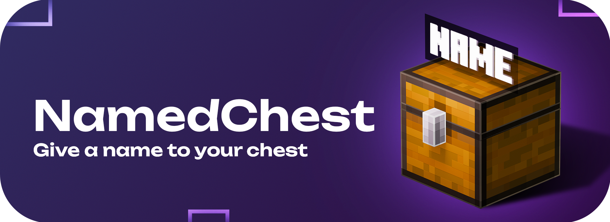

<div align="center">
    
    <h4>Support versions: Paper: 1.18.2 — 1.21.x</h4>
    <h1>Give a name to your chest</h1>
</div>

<div align="center" content="">
    <a href="https://modrinth.com/plugin/namedchest">
        
    </a>
</div>

### <a href="https://github.com/ilezzov-code/NamedChest/tree/main"> Выбрать русский README.md</a>

##  <a>Table of Contents</a>

- [About](#about)
- [Features](#features)
- [Config.yml](#config)
- [Commands](#commands)
- [Permissions](#permissions)
- [Links](#links)
- [Buy me coffee](#donate)
- [Report a bug](https://github.com/ilezzov-code/namedchest/issues)


## <a id="about">About</a>

**NamedChest** — is a unique plugin that allows you to name different blocks in Minecraft using commands, tags, and anvils! The name will be displayed as a hologram when you hover the cursor over it.
## <a id="features">Features</a>

* **[🔥] Hologram display on cursor hover** → [more details](#cursor-hover)
* Support for 2 languages (Russian, English) + the ability to create your own translation
* Support for 11 blocks → [more details](#supporting-blocks)
* Configuration of maximum distance to the block
* Support for MiniMessage in names → [more details](#minimessage-support)
* Assigning names using tags → [more details](#support-nametag)
* Setting maximum name length
* Save / Delete name when breaking a block
* Allow / Deny names via an anvil
* Allow / Deny support for spaces
* Full customization:
  * Enable / Disable each feature
  * Delay for using each command
  * Detailed permission system


## <a id="config">Config.yml</a>

<details>
    <summary>Looks config.yml</summary>

```yaml
# ███╗░░██╗░█████╗░███╗░░░███╗███████╗██████╗░░░░█████╗░██╗░░██╗███████╗░██████╗████████╗
# ████╗░██║██╔══██╗████╗░████║██╔════╝██╔══██╗░░██╔══██╗██║░░██║██╔════╝██╔════╝╚══██╔══╝
# ██╔██╗██║███████║██╔████╔██║█████╗░░██║░░██║░░██║░░╚═╝███████║█████╗░░╚█████╗░░░░██║░░░
# ██║╚████║██╔══██║██║╚██╔╝██║██╔══╝░░██║░░██║░░██║░░██╗██╔══██║██╔══╝░░░╚═══██╗░░░██║░░░
# ██║░╚███║██║░░██║██║░╚═╝░██║███████╗██████╔╝░░╚█████╔╝██║░░██║███████╗██████╔╝░░░██║░░░
# ╚═╝░░╚══╝╚═╝░░╚═╝╚═╝░░░░░╚═╝╚══════╝╚═════╝░░░░╚════╝░╚═╝░░╚═╝╚══════╝╚═════╝░░░░╚═╝░░░

# Developer / Разработчик: ILeZzoV

# Socials / Ссылки:
# • Contact with me / Связаться: https://t.me/ilezovofficial
# • Telegram Channel / Телеграм канал:
#    | RUS: https://t.me/ilezzov
#    | EN: https://t.me/ilezzov_en
# • GitHub: https://github.com/ilezzov-code

# By me coffee / Поддержать разработчика:
# • DA: https://www.donationalerts.com/r/ilezzov_dev
# • YooMoney: https://yoomoney.ru/to/4100118180919675
# • Telegram Gift: https://t.me/ilezovofficial
# • TON: UQCInXoHOJAlMpZ-8GIHqv1k0dg2E4pglKAIxOf3ia5xHmKV
# • BTC: 1KCM1QN9TNYRevvQD63UF81oBRSK67vCon
# • Card: 5536914188326494

# Supporting messages languages / Доступные языки сообщений:
# ru-RU, en-US
language: "en-US"

# Check the plugin for updates
# Проверять плагин на наличие обновлений
check_updates: true

# Enable / Disable the option to name a block | Включить / Отключить возможность давать имя блоку
# Supporting blocks / Поддерживаемые блоки: CHEST (сундук), TRAPPED_CHEST (сундук-ловушка),
# BARREL (бочка), FURNACE (печка), SMOKER (коптильня), BLAST_FURNACE (плавильня), HOPPER (воронка),
# DISPENSER (раздатчик), DROPPER (выбрасыватель), BREWING_STAND (варочная стойка), SHULKER_BOX (шалкер бокс)
supporting_block:
  - CHEST
  - TRAPPED_CHEST
  - BARREL
  - FURNACE
  - SMOKER
  - BLAST_FURNACE
  - HOPPER
  - DISPENSER
  - DROPPER
  - BREWING_STAND
  - SHULKER_BOX

# Maximum distance to the block / Максимальная дистанция до блока
max_distance: 5

# Item's name settings / Настройки имени блока
name_settings:
  # Enable support color name / Включить поддержку цветных имен
  support_color: true
  # Max name length / Максимальная длинна имени
  max_name_length: 25
  # Save the name when the block is destroyed / Сохранять имя при разрушении блока
  save_for_breaking: false
  # Forbid giving a name through an anvil / Запретить давать имя через наковальню
  cancel_anvil: true
  # Support for spaces in the name / Поддержка пробелов в имени
  support_spaces: true

# Enable / Disable plugin commands
# Включить / Выключить команды плагина
command_settings:
  enable_set: true # Enable command /nc set | Включить команду /nc set
  enable_clear: true # Enable command /nc clear | Включить команду /nc clear
  cooldown: 5 # Cooldown in using commands in seconds | Задержка на использование команд в секундах

# Don't edit this / Не редактируйте это
config_version: 1.2
```

</details>

## <a id="commands">Commands (/command → /alias1, /alias2, ... ※ `permission`)</a>

### /namedchest reload → /nc reload ※ `namedchest.reload`

* Reload the plugin configuration

### /namedchest version → /nc version ※ ``

* Check the latest plugin version

### /namedchest set → /nc set ※ `namedchest.name.set`

* Set the name of a block

### /namedchest clear → /nc clear ※ `namedchest.name.clear`

* Clear the block's name


## <a id="permissions">All plugin permissions</a>

| Право                      | Описание                                    |
|----------------------------|---------------------------------------------|
| namedchest.*               | Access to all plugin features               |
| namedchest.reload          | Access to reload the plugin /nc reload      |
| namedchest.no_cooldown     | Disable cooldown for any feature            |
| namedchest.name.set        | Access to the /nc set command               |
| namedchest.name.set.color  | Allow setting colored names                 |
| namedchest.name.clear      | Access to the /nc clear command             |
| namedchest.name.max.length | Remove maximum length restriction for names |

## <a id="cursor-hover">Hologram display on cursor hover 🔥</a>

This is a unique feature of the plugin that enhances performance. Names are only displayed when hovering over an item — this allows spawning holograms only at the necessary moment, significantly reducing Entity count and load.

Names appear next to chests on the side the player is facing.


## <a id="supporting-blocks">Supporting Blocks</a>

The plugin supports 11 blocks:

- CHEST (chest)
- TRAPPED_CHEST (trapped-chest)
- BARREL (barrel)
- FURNACE (furnace)
- SMOKER (smoker)
- BLAST_FURNACE (blast furnace)
- HOPPER (hopper)
- DISPENSER (dispenser)
- DROPPER (dropper)
- BREWING_STAND (brewing stand)
- SHULKER_BOX (shulker box)


You can customize which blocks to include or exclude in the plugin configuration under the `supporting_block` section.

<details>
  <summary>config.yml → supporting_blocks</summary>

```yml
supporting_block:
  - CHEST
  - TRAPPED_CHEST
  - BARREL
  - FURNACE
  - SMOKER
  - BLAST_FURNACE
  - HOPPER
  - DISPENSER
  - DROPPER
  - BREWING_STAND
  - SHULKER_BOX   
 ```
</details>

## <a id="minimessage-support">Support MiniMessage</a>

The plugin supports all types of message formatting.

- LEGACY — Color with & / § and HEX with &#rrggbb / §#rrggbb or &x&r&r&g&g&b&b / §x§r§r§g§g§b§b
- LEGACY_ADVANCED — Color and HEX with &##rrggbb / §##rrggbb
- MINI_MESSAGE — Color with <color> More info — https://docs.advntr.dev/minimessage/index.html

And all formats available at https://www.birdflop.com/resources/rgb/  
You can use all formats simultaneously in one message. The plugin supports this.

## <a id="support-nametag">Naming via Name Tags</a>

You can assign names to blocks using tags.


## <a id="links">Links</a>

* Contact: https://t.me/ilezovofficial
* Telegram Channel: https://t.me/ilezzov_en
* Modrinth: https://modrinth.com/plugin/namedchest

## <a id="donate">Buy me coffee</a>

* DA: https://www.donationalerts.com/r/ilezzov_dev
* YooMoney: https://yoomoney.ru/to/4100118180919675
* Telegram Gift: https://t.me/ilezovofficial
* TON: UQCInXoHOJAlMpZ-8GIHqv1k0dg2E4pglKAIxOf3ia5xHmKV
* BTC: 1KCM1QN9TNYRevvQD63UF81oBRSK67vCon
* Card: 5536914188326494

## Found an issue or have a question? Create a new issue — https://github.com/ilezzov-code/NamedChest/issues/new

## <a id="license">License</a>

This project is distributed under the `GPL-3.0 License`. For more details, see the LICENSE file.