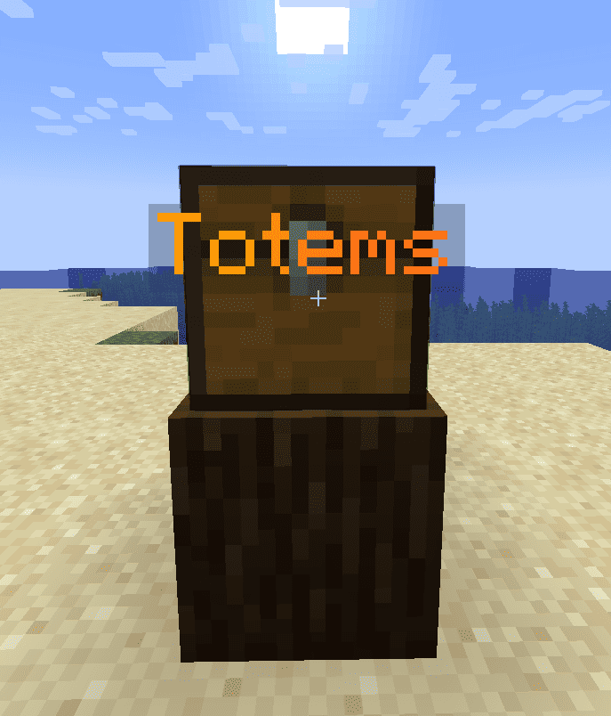
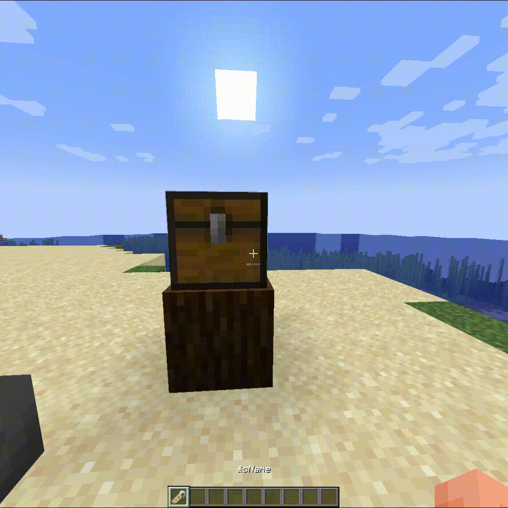
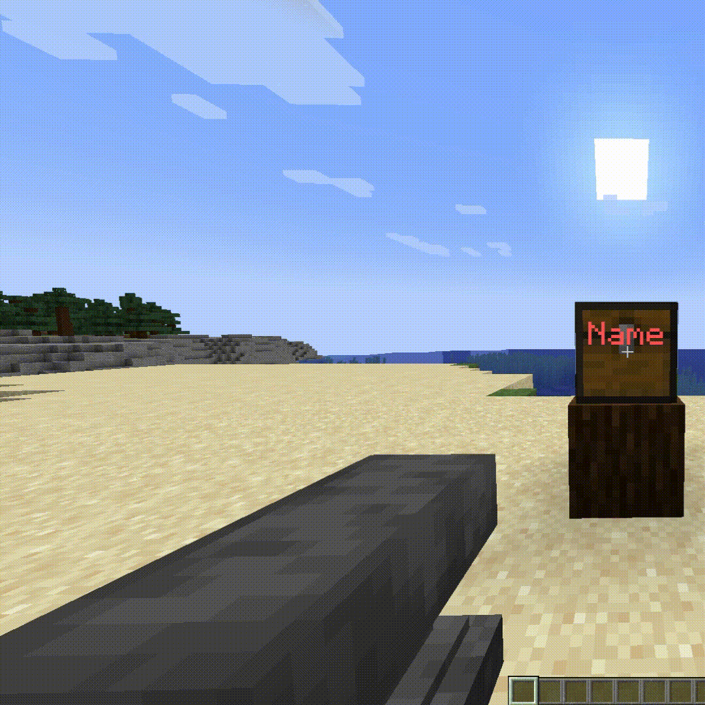

<div align="center">
    
</div>

<div align="center">
    <h1>Name Your Chest</h1>
    <p>Supported versions: Paper 1.18.2 — 1.21.x</p>
</div>

###  [Перейти на Русскую версию](readmes/README_RU.md)

## Plugin Pages:
* **Modrinth** — soon
* **Hangar** — soon
* **Spigot** — soon
* **Spigot RU** — soon

## Description:
NamedChest is a plugin that lets you assign custom names to various blocks. Now you can easily identify your chests without using item frames.

## Features:
* Set block names using a name tag
* Two language support
* HEX and MiniMessage formatting support
* Enable / Disable color name support
* Set the maximum name length
* Supported blocks: CHEST, TRAPPED_CHEST, BARREL, FURNACE, SMOKER, BLAST_FURNACE, HOPPER,
  DISPENSER, DROPPER, BREWING_STAND, SHULKER_BOX
* Permission system
* Set / Clear names using the `/nc` command

## Commands

### /nc set <name>
* Set a name
* Permission: `namedchest.name.set`

### /nc clear
* Clear the name
* Permission: `namedchest.name.clear`

## Plugin Permissions

| Permission                  | Description                                         |
|----------------------------|-----------------------------------------------------|
| namedchest.*               | Access to all plugin features                       |
| namedchest.reload          | Access to `/nc reload`                              |
| namedchest.name.set        | Allow setting a name                                |
| namedchest.name.set.color  | Allow setting a colored name                        |
| namedchest.name.clear      | Allow clearing names via `/nc clear`                |
| namedchest.name.max.lenght | Allow exceeding the maximum name length            |

## Supported Languages
* ru-RU → Russian (Russia)
* en-US → English (US)

## Config File: `config.yml`

<details>
  <summary>config.yml</summary>

  ```yml
    # ███╗░░██╗░█████╗░███╗░░░███╗███████╗██████╗░░░░█████╗░██╗░░██╗███████╗░██████╗████████╗
    # ████╗░██║██╔══██╗████╗░████║██╔════╝██╔══██╗░░██╔══██╗██║░░██║██╔════╝██╔════╝╚══██╔══╝
    # ██╔██╗██║███████║██╔████╔██║█████╗░░██║░░██║░░██║░░╚═╝███████║█████╗░░╚█████╗░░░░██║░░░
    # ██║╚████║██╔══██║██║╚██╔╝██║██╔══╝░░██║░░██║░░██║░░██╗██╔══██║██╔══╝░░░╚═══██╗░░░██║░░░
    # ██║░╚███║██║░░██║██║░╚═╝░██║███████╗██████╔╝░░╚█████╔╝██║░░██║███████╗██████╔╝░░░██║░░░
    # ╚═╝░░╚══╝╚═╝░░╚═╝╚═╝░░░░░╚═╝╚══════╝╚═════╝░░░░╚════╝░╚═╝░░╚═╝╚══════╝╚═════╝░░░░╚═╝░░░

    # Developer / Разработчик: ILeZzoV

    # Socials / Ссылки:
    # • Contact with me / Связаться: https://t.me/ilezovofficial
    # • Telegram Channel / Телеграм канал:
    #    | RUS: https://t.me/ilezzov
    #    | EN: https://t.me/ilezzov_en
    # • GitHub: https://github.com/ilezzov-code

    # By me coffee / Поддержать разработчика:
    # • DA: https://www.donationalerts.com/r/ilezzov_dev
    # • YooMoney: https://yoomoney.ru/to/4100118180919675
    # • Telegram Gift: https://t.me/ilezovofficial
    # • TON: UQCInXoHOJAlMpZ-8GIHqv1k0dg2E4pglKAIxOf3ia5xHmKV
    # • BTC: 1KCM1QN9TNYRevvQD63UF81oBRSK67vCon
    # • Card: 5536914188326494

    # Supporting messages languages / Доступные языки сообщений:
    # ru-RU, en-US
    language: "ru-RU"

    # Check the plugin for updates
    # Проверять плагин на наличие обновлений
    check_updates: true

    # Enable / Disable the option to name a block | Включить / Отключить возможность давать имя блоку
    # Supporting blocks / Поддерживаемые блоки: CHEST (сундук), TRAPPED_CHEST (сундук-ловушка),
    # BARREL (бочка), FURNACE (печка), SMOKER (коптильня), BLAST_FURNACE (плавильня), HOPPER (воронка),
    # DISPENSER (раздатчик), DROPPER (выбрасыватель), BREWING_STAND (варочная стойка), SHULKER_BOX (шалкер бокс)
    supporting_block:
      - CHEST
      - TRAPPED_CHEST
      - BARREL
      - FURNACE
      - SMOKER
      - BLAST_FURNACE
      - HOPPER
      - DISPENSER
      - DROPPER
      - BREWING_STAND
      - SHULKER_BOX

    # Maximum distance to the block / Максимальная дистанция до нужного блока
    block_max_distant: 5

    # Item's name settings / Настроить название предмета:
    name_settings:
      # Enable support color name / Включить поддержку цветных имен
      support_color: true
      # Max name length / Максимальная длинна имени
      max_name_length: 25

    # Don't edit this / Не редактируйте это
    config_version: 1.0
  ```
</details>

## Screenshots:

### Example name


### Name appears on hover


### Set name using a name tag


### Clear name using command


## Links:
* Contact: https://t.me/ilezovofficial
* Telegram channel: https://t.me/ilezzov
* GitHub: https://github.com/ilezzov-code

## Support the developer:
* DA: https://www.donationalerts.com/r/ilezzov_dev
* YooMoney: https://yoomoney.ru/to/4100118180919675
* Telegram Gift: https://t.me/ilezovofficial
* TON: UQCInXoHOJAlMpZ-8GIHqv1k0dg2E4pglKAIxOf3ia5xHmKV
* BTC: 1KCM1QN9TNYRevvQD63UF81oBRSK67vCon
* Card: 5536914188326494

## Found a bug or have a question? Open a new issue — https://github.com/ilezzov-code/NamedChest/issues/new

